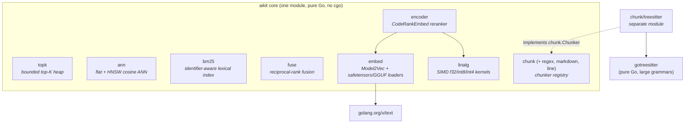
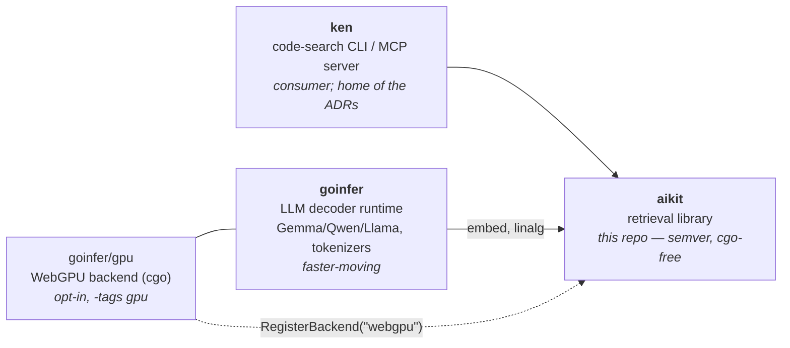
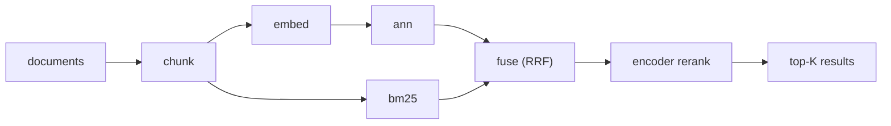

# aikit architecture

How the pieces fit together: the package DAG, the surrounding repo ecosystem,
the two dependency quarantines, and where the load-bearing invariants live.
For what each package *does*, see the [README package table](../README.md#packages);
for API stability, the [stability tiers](../README.md#stability-tiers). This
doc is about structure and the decisions behind it.

## Design rules

Four rules generate most of the structure:

1. **The core stays pure Go (no cgo).** Enforced in CI (`CGO_ENABLED=0` build
   + a dependency-graph grep). Anything that would break this is pushed
   behind a seam (§ Backend) or into a separate module (§ Quarantines).
2. **Packages are small leaves; the DAG stays shallow.** Most packages depend
   on nothing but the stdlib. Only `encoder` composes other aikit packages.
3. **Numerics are parity-pinned.** Every model-touching path (`embed`,
   `encoder`, the `linalg` quant kernels) is tested against golden fixtures
   produced by Python references in [`scripts/`](../scripts/) — see
   [`testdata/README.md`](../testdata/README.md).
4. **Indexes are immutable after build.** Every retrieval index — `ann.Flat`,
   `ann.HNSW`, `ann.FlatI8`, `bm25.Index`, `sparse.Index` — is read-only once
   built. This is a cornerstone, not an accident: it buys two things the rest of
   the design leans on, and gives them up the moment in-place mutation is allowed.

   - **Lock-free concurrent reads.** A built index takes no locks in `Query`, so
     it scales across goroutines for free. Mutation would force an `RWMutex` (or
     hand-rolled lock-free structures) onto the query hot path — slower, and a
     whole class of concurrency bugs that immutability simply does not have.
   - **Snapshot consistency without coordination.** A "the corpus changed" update
     builds a *new* index and swaps a pointer atomically (ken's ADR-012 pattern);
     a reader holds one consistent snapshot for the life of a query — no torn
     reads, no mid-query mutation.

   Changing corpora are served *without* breaking this, in increasing order of
   freshness: **rebuild-and-swap** (the default — re-index, publish the new
   pointer); a **base + delta + fuse** split (a small, frequently-rebuilt delta
   index fused with the big base via `fuse.RRF`/`RSF`, periodically folded in);
   and **logical delete** via a caller-supplied tombstone predicate
   (`Flat`/`HNSW`/`FlatI8` `QueryFilter`) consulted at query time — the index
   itself is never mutated. True in-place mutation (HNSW tombstone graph-repair,
   concurrent `Add`-during-`Query`, incremental BM25 segments) is deliberately out
   of scope: it's a mutable-database concern that would trade away both properties
   above, for a use case outside aikit's embedded, read-heavy niche.

## Package DAG

Everything not shown depending on something depends only on the stdlib.
`topk`, `ann`, `bm25`, `fuse`, `chunk`, `linalg` are leaves; `embed` adds one
dependency (`golang.org/x/text`, for tokenizer normalization); `encoder` is
the sole composite. The dotted edge is registry-based, not an import: the
`chunk/treesitter` module registers itself via `chunk.Register` on import.

## Repo ecosystem

aikit is the stable middle of a three-repo system:

aikit was extracted so the retrieval core could make a semver promise while
the LLM runtime keeps moving (the split is recorded in goinfer's
[`migration-plan.md`](https://github.com/townsendmerino/goinfer/blob/main/docs/migration-plan.md);
the motivating critique in
[`internal/road-to-1.0-critique.md`](./internal/road-to-1.0-critique.md)).
Dependencies point inward only: goinfer and ken import aikit; aikit imports
neither.

## The Backend seam

The most consequential decision in the repo
([`encoder/backend.go`](../encoder/backend.go)): the encoder's forward pass
abstracts exactly one primitive — `MatmulBT` (`dst[M,N] = a[M,K]·b[N,K]ᵀ`,
the safetensors `[out,in]` weight layout, so no transpose copy). Norms,
RoPE, softmax, and elementwise ops always run on CPU; only the big weight
matmuls route through the `Backend` interface.

The default `"cpu"` backend (pure-Go SIMD) is compiled in. GPU is an
*inversion*: `goinfer/gpu`, built with `-tags gpu`, calls
`encoder.RegisterBackend("webgpu", …)` from its `init()`. aikit gains GPU
acceleration without the cgo WebGPU dependency ever entering its module
graph — and `NewBackend("webgpu")` on a non-GPU build degrades to CPU with
an explanatory error rather than failing.

Why only matmul: it's the hot path by a wide margin, and keeping everything
else on CPU avoids a host↔device round-trip per layer.

## Quarantines

Two dependencies are deliberately kept out of the core module graph, each by
a different mechanism (CI enforces both):

| Dependency | Why quarantined | Mechanism |
|---|---|---|
| `cogentcore/webgpu` (cgo) | would break the no-cgo promise | inverted behind `encoder.Backend`; lives in `goinfer/gpu` |
| `gotreesitter` (pure Go, ~large embedded grammars; pre-1.0 upstream) | payload size + upstream churn risk | separate module `chunk/treesitter`, registers via `chunk.Register`; versioned in lockstep with the core |

## Retrieval pipeline (how a consumer composes it)

The packages are independent; the canonical composition
([`examples/rag/`](../examples/rag)) is:

Nothing in aikit requires this shape — each stage is independently usable,
and `fuse` works on any rankings with comparable keys.

## Where the invariants live

The correctness-critical contracts are documented at the point of use; this
is the index:

| Invariant | Lives at |
|---|---|
| `ann` requires L2-normalized inputs; normalization happens at the `embed` boundary | [README carry-over invariants](../README.md#carry-over-invariants-read-these-once), `ann/flat.go` doc |
| `embed` accumulates in float64 (f32 silently breaks golden parity on longer inputs) | `embed/model.go` precision contract, `embed/pool.go` |
| `bm25` tokenizer and `encoder` weights are code-tuned (a hidden assumption for general NLP) | README carry-over invariants, `bm25/tokenize.go` |
| mmap-backed tensors must not outlive their `Close()` | `embed` mmap loader docs |
| Quant kernels trust block-size-aligned K (caller contract) | `linalg/quant.go` |
| Parallel matmuls are bit-identical at any width (column partition) | `linalg/linalg.go`, CHANGELOG 0.5.1 |
| Kernel dispatch / CPU feature detection map | [`internal/cpu-acceleration.md`](./internal/cpu-acceleration.md) |

## ADR index

Code comments cite ADRs by number (e.g. `bm25/tokenize.go`, `chunk/registry.go`,
`topk/topk.go`). **The ADR documents live in the ken repo** (aikit's packages
originated there; the records stayed with the project journal). The numbers
cited from aikit code, with the decision each is invoked for:

| ADR | Cited from | Invoked for |
|---|---|---|
| ADR-005 | `chunk/treesitter` | the swap-out path if `gotreesitter` breaks |
| ADR-006 | `bm25/tokenize.go` | code-tuned tokenization is intentional |
| ADR-008 | `bm25/tokenize.go` | verbatim parity as the tokenizer contract |
| ADR-010 | `chunk/*` | chunker registry + graceful-degradation behavior |
| ADR-012 | `ann/flat.go` | exact flat scan as the baseline ANN |
| ADR-025 | `topk`, `bm25`, `ann` | K-sized stable sort for deterministic ties |
| ADR-026 | `topk/topk.go` | heap selector vs alternatives |
| ADR-027 / 028 | `bm25/tokenize.go` | byte-scanning tokenizer + buffer reuse |
| ADR-029 | `embed` race test | concurrent-encode safety contract |
| ADR-032 | `chunk/*` | public `Chunker` interface + registry as 1.0 surface |

If ken's ADR directory is ever published or relocated, update this table to
deep-link; until then this index is the in-repo resolution for those
references.
